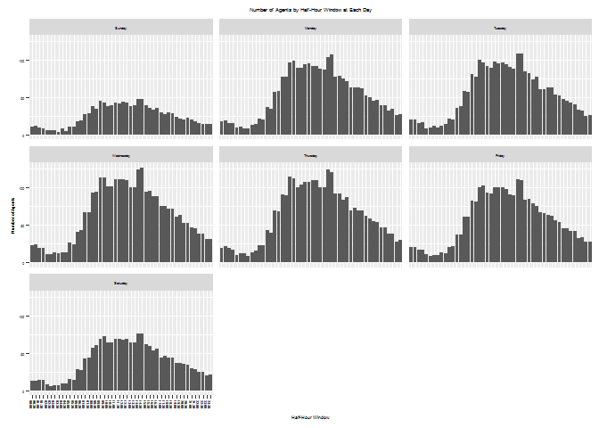

<!-- README.md is generated from README.Rmd. Please edit that file -->
scheduler
=========

scheduler is designed to fulfill scheduling process in operations, such as customer service center or warehouse fulfillment center, where the requirement are often the number of agents needed at each hour day, and the constraint are often the availability of each agent at each hour day.

An Example
----------

The package associated data `agent_requirement` demonstrates a input data format for `scheduler` - a matrix of 48 half hour window by 7 days. These are the number of agents required at each half hour window at each day.

``` r
#- load scheduler package
library(scheduler)
#> Warning: package 'ggplot2' was built under R version 3.3.1

#- attach data in package
data("agent_requirement")

knitr::kable(agent_requirement)
```

|       |  Sunday|  Monday|  Tuesday|  Wednesday|  Thursday|  Friday|  Saturday|
|-------|-------:|-------:|--------:|----------:|---------:|-------:|---------:|
| 00:00 |      11|      18|       20|         23|        20|      21|        13|
| 00:30 |      12|      19|       20|         24|        22|      21|        13|
| 01:00 |      10|      16|       16|         20|        19|      17|        14|
| 01:30 |       9|      16|       17|         19|        17|      17|        14|
| 02:00 |       6|      10|        8|         11|        10|      11|         8|
| 02:30 |       6|      11|       10|         11|        12|       9|         5|
| 03:00 |       6|       8|       12|         13|        12|      10|         7|
| 03:30 |       4|       9|       10|         12|         9|      10|         7|
| 04:00 |       8|      13|       12|         13|        13|      14|         9|
| 04:30 |       5|      14|       14|         13|        16|      12|         9|
| 05:00 |      11|      22|       22|         27|        23|      21|        15|
| 05:30 |      11|      20|       20|         24|        23|      22|        14|
| 06:00 |      18|      37|       36|         41|        43|      37|        28|
| 06:30 |      19|      35|       38|         43|        40|      37|        27|
| 07:00 |      27|      57|       58|         67|        69|      61|        42|
| 07:30 |      29|      58|       57|         67|        68|      61|        44|
| 08:00 |      38|      78|       81|         93|        91|      83|        57|
| 08:30 |      35|      77|       78|         94|        90|      81|        60|
| 09:00 |      45|      97|      100|        114|       115|     100|        69|
| 09:30 |      43|      99|       97|        114|       112|     103|        72|
| 10:00 |      38|      89|       92|        102|       101|      93|        64|
| 10:30 |      39|      89|       90|        102|       104|      92|        64|
| 11:00 |      43|      94|       98|        111|       108|     101|        68|
| 11:30 |      42|      95|       96|        111|       108|     100|        68|
| 12:00 |      44|      92|       97|        111|       110|     101|        67|
| 12:30 |      43|      92|       94|        110|       110|      98|        69|
| 13:00 |      38|      88|       91|        101|       100|      91|        64|
| 13:30 |      39|      87|       88|        101|       100|      90|        64|
| 14:00 |      48|     104|      109|        124|       124|     111|        76|
| 14:30 |      48|     107|      109|        127|       121|     110|        76|
| 15:00 |      39|      78|       85|         95|        92|      84|        61|
| 15:30 |      36|      79|       82|         96|        92|      85|        59|
| 16:00 |      34|      75|       74|         89|        84|      79|        53|
| 16:30 |      36|      72|       77|         89|        87|      76|        55|
| 17:00 |      30|      63|       61|         75|        70|      67|        44|
| 17:30 |      27|      63|       61|         75|        73|      66|        46|
| 18:00 |      30|      63|       63|         72|        70|      64|        44|
| 18:30 |      29|      62|       63|         72|        69|      62|        44|
| 19:00 |      24|      53|       54|         61|        62|      56|        36|
| 19:30 |      22|      50|       52|         63|        59|      54|        36|
| 20:00 |      20|      46|       48|         53|        55|      46|        35|
| 20:30 |      23|      47|       45|         53|        54|      46|        34|
| 21:00 |      20|      39|       43|         47|        47|      42|        29|
| 21:30 |      18|      40|       41|         46|        47|      42|        28|
| 22:00 |      16|      32|       34|         38|        38|      33|        24|
| 22:30 |      15|      35|       32|         38|        39|      34|        25|
| 23:00 |      14|      26|       25|         31|        28|      28|        20|
| 23:30 |      15|      27|       26|         31|        30|      28|        21|

The package associated also a visualization function for viewing the requirement:

``` r
#- visualize the requirement
scheduler::plot_schedule(m = agent_requirement, element_text_size = 4L)
```


<p class="caption">
scheduler - visulation
</p>

The `scheduler` function takes `ar (agent_requirement)` as requirement, and makes shedules based on `sm (schedule module)` and `cr (constraints)` as constraints.

There are 3 built in `sm (schedule module)`:

-   All agents are assumed to work consecutive 5 days given a start day, e.g., when start at Thursday, agent will work on Thursday, Friday, Saturday, Sunday, Monday, and take rest on Tuesday and Wednsday.

-   In schedule module 1: agent will start an half hour window, say 08:30AM, work 3.5 hour, take 0.5 hour break, and work another 4.5 hour.

-   In schedule module 2: agent will start an half hour window, say 08:30AM, work 4.0 hour, take 0.5 hour break, and work another 4.0 hour.

-   In schedule module 3: agent will start an half hour window, say 08:30AM, work 4.5 hour, take 0.5 hour break, and work another 3.5 hour.

-   As a result, if an agent is scheduled in schedule module 1, with a start time at 08:30AM Tuesday, then he or she will work from Tuesday 08:30AM - 12:00PM, take rest 12:00PM - 12:30PM, and back to work 12:30PM - 17:00PM, and same on Wednesday, Thursday, Friday, and Saturday. He or she will take rest on Sunday, and Monday.

-   Similarly, if an agent is scheduled in schedule module 2, with a start time at 14:00PM Wednesday, then he or she will work from Wednesday 14:00PM - 18:00PM, take rest 18:00PM - 18:30PM, and back to work 18:30PM - 22:30PM, and same on Thursday, Friday, Saturday, Sunday. He or she will take rest on Monday, and Tuesday.

The argument `cr (constraints)` takes half-hour index as contraints that should remove from start time.

The half-hour index start with 1L represents 00:00AM-00:30AM half-hour window on Sunday, 2L represents 00:30AM-01:00AM half-hour window on Sunday, ..., 48L represents 23:30AM-00:00AM half-hour window on Sunday, 49L represents 00:00AM-00:30AM half-hour window on Monday, ..., and up to 336L represents 23:30AM-00:00AM half-hour window on Saturday.

By default, `cr = c(3L:12L, 51L:60L, 99L:108L, 147L:156L, 195L:204L, 243L-252L, 291L:300L)`. This implies no agent would start at 01:00AM - 05:30AM on any day.

There is another argument `allow.half.hour.start` that can be used to specify whether allowing none whole hour start time. By default, `allow.half.hour.start` is `TRUE`, so start at 7:00AM and start at 7:30AM are two schedule. If `allow.half.hour.start` is set to `FALSE`, then no agent will start at 00:30AM, 01:30AM, ..., 23:30AM on any day. This is a short cut for sepecifying all corresponding contraints with `cr`.

Suppose we want a schedule that can use all 3 schedule modules with default constraints that no one start between 01:00AM - 05:30AM on any day.

``` r
#- suppose we want a schedule with default setting
(ss_list_01 <- scheduler(ar = agent_requirement, sm = c(1L, 2L, 3L)))
#> $s1
#>       [,1] [,2] [,3] [,4] [,5] [,6] [,7]
#>  [1,]    2    0    3    0    0    0    0
#>  [2,]    0    3    1    0    0    0    1
#>  [3,]    0    0    0    0    0    0    0
#>  [4,]    0    0    0    0    0    0    0
#>  [5,]    0    0    0    0    0    0    0
#>  [6,]    0    0    0    0    0    0    0
#>  [7,]    0    0    0    0    0    0    0
#>  [8,]    0    0    0    0    0    0    0
#>  [9,]    0    0    0    0    0    3    0
#> [10,]    0    0    0    0    0    0    0
#> [11,]    0    0    0    0    0    1    0
#> [12,]    0    0    0    0    0    0    0
#> [13,]    0    1    1    0    1    0    0
#> [14,]    5    2    7    1    0    0    0
#> [15,]    0    3    1    2    0    0    0
#> [16,]    0    2    1    0    0    0    5
#> [17,]    6    1    1    1    1    0    0
#> [18,]    0    4    4    2    0    0    0
#> [19,]    1    3    1    0    4    0    0
#> [20,]    1    1    0    1    1    0    0
#> [21,]    0    1    0    0    0    0    0
#> [22,]    0    5    1    1    0    0    2
#> [23,]    0    0    0    0    0    0    0
#> [24,]    0    1    0    0    0    0    0
#> [25,]    0    1    0    1    1    0    0
#> [26,]    0    1    2    0    0    0    0
#> [27,]    1    0    0    2    1    0    2
#> [28,]    0   14    2    5    1    0    0
#> [29,]    0    1    0    0    0    0    0
#> [30,]    0    0    0    0    0    0    0
#> [31,]    0    0    0    0    0    0    1
#> [32,]    0    1    0    0    0    1    1
#> [33,]    0    1    0    0    3    0    2
#> [34,]    2    4    4    0    1    0    0
#> [35,]    0    3    2    2    1    0    0
#> [36,]    4    3    1    0    1    0    0
#> [37,]    0    0    0    0    0    1    0
#> [38,]    0    0    0    0    0    0    0
#> [39,]    0    0    0    0    0    0    0
#> [40,]    0    0    0    0    0    0    0
#> [41,]    0    0    0    0    0    0    0
#> [42,]    0    0    0    0    0    0    0
#> [43,]    0    0    0    0    0    0    0
#> [44,]    2    0    1    0    0    0    0
#> [45,]    9    1    0    0    0    0    0
#> [46,]    0    1    1    0    0    0    0
#> [47,]    0    0    0    0    0    0    0
#> [48,]    0    0    0    0    0    0    0
#> 
#> $s2
#>       [,1] [,2] [,3] [,4] [,5] [,6] [,7]
#>  [1,]    0    0    0    0    0    0    0
#>  [2,]    0    0    0    0    0    0    2
#>  [3,]    0    0    0    0    0    0    0
#>  [4,]    0    0    0    0    0    0    0
#>  [5,]    0    0    0    0    0    0    0
#>  [6,]    0    0    0    0    0    0    0
#>  [7,]    0    0    0    0    0    0    0
#>  [8,]    0    0    0    0    0    0    0
#>  [9,]    0    0    0    0    0    0    0
#> [10,]    0    0    0    0    0    0    0
#> [11,]    0    0    0    0    0    0    0
#> [12,]    0    0    0    0    0    0    0
#> [13,]    0    1    0    0    2    0    0
#> [14,]    0    0    0    0    0    0    0
#> [15,]    0    8    0    0    0    0    0
#> [16,]    0    0    0    0    0    0    0
#> [17,]    0    0    0    0    0    0    0
#> [18,]    0    0    0    0    0    0    0
#> [19,]    0    9    0    4    0    0    6
#> [20,]    0    0    0    0    0    0    0
#> [21,]    0    0    0    0    0    0    0
#> [22,]    0    0    0    0    0    0    0
#> [23,]    0    0    0    0    0    0    0
#> [24,]    0    0    0    0    0    0    0
#> [25,]    0    0    0    0    0    0    0
#> [26,]    0    0    0    0    0    0    0
#> [27,]    0    0    0    0    0    0    0
#> [28,]    0    0    0    0    0    0    0
#> [29,]    0    0    0    0    0    0    0
#> [30,]    0    0    0    0    0    0    0
#> [31,]    0    0    0    0    0    0    0
#> [32,]    0    0    0    0    0    0    0
#> [33,]    0    0    0    0    0    0    0
#> [34,]    0    0    0    0    0    0    0
#> [35,]    0    0    0    0    0    0    0
#> [36,]    0    0    0    0    0    0    0
#> [37,]    0    0    0    0    0    0    0
#> [38,]    0    0    0    0    0    0    0
#> [39,]    0    0    0    0    0    0    0
#> [40,]    0    0    0    0    0    0    0
#> [41,]    0    0    0    0    0    0    0
#> [42,]    0    0    0    0    0    0    0
#> [43,]    0    0    0    0    0    0    0
#> [44,]    0    0    0    0    0    0    0
#> [45,]    0    0    0    0    0    0    0
#> [46,]    0    0    0    0    0    0    0
#> [47,]    0    0    0    0    0    0    0
#> [48,]    0    0    0    0    0    0    0
#> 
#> $s3
#>       [,1] [,2] [,3] [,4] [,5] [,6] [,7]
#>  [1,]    0    0    0    0    0    0    0
#>  [2,]    0    0    0    0    0    0    0
#>  [3,]    0    0    0    0    0    0    0
#>  [4,]    0    0    0    0    0    0    0
#>  [5,]    0    0    0    0    0    0    0
#>  [6,]    0    0    0    0    0    0    0
#>  [7,]    0    0    0    0    0    0    0
#>  [8,]    0    0    0    0    0    0    0
#>  [9,]    0    0    0    0    0    0    0
#> [10,]    0    0    0    0    0    0    0
#> [11,]    0    0    0    0    0    0    0
#> [12,]    0    0    0    0    0    0    0
#> [13,]    0   11    5    0    0    0    5
#> [14,]    0    0    0    0    0    0    0
#> [15,]    0    4    4    0    2    0    0
#> [16,]    0    2    2    0    5    0    0
#> [17,]    0    0    0    0    0    0    0
#> [18,]    0    0    0    0    0    0    0
#> [19,]    0    0    0    0    0    0    0
#> [20,]    0    0    0    0    0    0    0
#> [21,]    0    0    0    0    0    0    0
#> [22,]    0    0    0    0    0    0    0
#> [23,]    0    0    0    0    0    0    0
#> [24,]    0    0    0    0    0    0    0
#> [25,]    0    0    0    0    0    0    0
#> [26,]    0    0    0    0    0    0    0
#> [27,]    0    0    0    0    0    0    0
#> [28,]    0    0    0    0    0    0    0
#> [29,]    0    0    0    0    0    0    0
#> [30,]    0    0    0    0    0    0    0
#> [31,]    0    0    0    0    0    0    0
#> [32,]    0    0    0    0    0    0    0
#> [33,]    0    0    0    0    0    0    0
#> [34,]    0    0    1    0    0    0    2
#> [35,]    0    0    0    0    0    0    0
#> [36,]    0    0    0    0    0    0    0
#> [37,]    0    0    0    0    0    0    0
#> [38,]    0    0    0    0    0    0    0
#> [39,]    0    0    0    0    0    0    0
#> [40,]    0    0    0    0    0    0    0
#> [41,]    0    0    0    0    0    0    0
#> [42,]    0    0    0    0    0    0    0
#> [43,]    0    0    0    0    0    0    0
#> [44,]    0    0    0    0    0    0    0
#> [45,]    0    0    0    0    0    0    0
#> [46,]    0    0    0    0    0    0    0
#> [47,]    0    0    0    0    0    0    0
#> [48,]    0    0    0    0    0    0    0
#> 
#> $ss
#>       Sunday Monday Tuesday Wednesday Thursday Friday Saturday
#> 00:00     25     32      46        50       51     51       35
#> 00:30     23     33      47        54       52     51       35
#> 01:00     14     26      36        38       36     36       24
#> 01:30     10     16      24        26       22     21       16
#> 02:00      7     20      25        26       22     20       10
#> 02:30      7     19      25        27       24     22       11
#> 03:00      7     19      25        27       24     22       11
#> 03:30      5     17      20        22       19     19        8
#> 04:00      9     18      23        22       20     21       12
#> 04:30      8     20      26        25       24     25       12
#> 05:00     11     23      29        27       24     26       15
#> 05:30     11     23      29        27       24     26       15
#> 06:00     18     42      51        48       43     45       28
#> 06:30     24     40      55        53       48     45       35
#> 07:00     27     57      74        73       70     67       42
#> 07:30     34     68      83        85       82     76       52
#> 08:00     45     79      94        94       92     83       58
#> 08:30     44     80      96        99       97     89       60
#> 09:00     57     98     110       116      115    107       72
#> 09:30     59     99     110       117      116    107       72
#> 10:00     52     92      98       104      102     98       64
#> 10:30     56     90      96       102      105     96       65
#> 11:00     58     94     105       113      116    107       72
#> 11:30     53     96     106       113      108    105       69
#> 12:00     58    101     111       118      112    103       67
#> 12:30     57    102     118       130      125    114       74
#> 13:00     55     96     109       118      121    109       72
#> 13:30     73    127     140       160      159    145       91
#> 14:00     70    122     134       153      154    140       87
#> 14:30     65    108     118       138      139    125       77
#> 15:00     60    101     104       123      123    114       70
#> 15:30     56     86      87       102       98     90       61
#> 16:00     53     79      76        92       90     82       53
#> 16:30     44     77      81        94       91     88       55
#> 17:00     45     66      65        75       71     67       51
#> 17:30     41     65      68        79       79     72       46
#> 18:00     39     64      68        77       76     71       45
#> 18:30     38     62      66        75       75     70       44
#> 19:00     34     53      56        65       67     61       39
#> 19:30     31     50      56        64       64     59       36
#> 20:00     33     48      48        56       56     53       36
#> 20:30     31     49      52        57       56     51       34
#> 21:00     27     42      43        50       51     50       32
#> 21:30     29     49      53        59       60     53       32
#> 22:00     33     45      48        48       48     33       25
#> 22:30     33     45      49        49       49     34       26
#> 23:00     33     45      49        49       49     34       26
#> 23:30     32     44      48        48       49     34       25
#> 
#> $scheduleOptModel
#> Model name: 
#>   a linear program with 1008 decision variables and 519 constraints
```

The output from `scheduler` is a list of 4 matrix `s1`, `s2`, `s3`, `ss` and a solved lp model `scheduleOptModel`.

The matricies `s1`, `s2` and `s3` each is a 48 x 7 matrix of number of agents required to start at each half hour window each day. The matrix `s1`, `s2`, and `s3` are a coresponding to schedule module 1, schedule module 2, and schedule module 3, respectively. For example, `s1[14, 2] = 3` implies we need 3 agents to start at 6:30AM Monday with schedule module 1. Note that even when you specify `sm = c(2L, 3L)` when calling `scheduler`, it will still return all 3 matricies `s1`, `s2`, `s3`, only that `s1` would contains all zeros.

The matrix `ss` is a 48 x 7 matrix, and is a summarize of s1, s2 and s3 to show the number of agents **available (not start)** at each half hour window. A quality solution should have `all(ss > ar)` and `ss - ar ~ 0` in all cells.

What if we want a schedule that can use schedule module 2L and 3L only, and does not all half-hour start, e.g., no agent start at 00:30AM, 01:30AM, ..., 23:30AM on any day, in addition with default constraints that no one start between 01:00AM - 05:30AM on any day.

``` r
#- suppose we want a schedule allow shedule module 2L and 3L only, 
## and disable half-hour start, more constraints - less effective.
ss_list_02 <- scheduler(
  ar = agent_requirement, sm = c(2L, 3L),
  allow.half.hour.start = FALSE)

## compare the num of total agent required by solution ss_list_01 
## and solution ss_list_02
with(ss_list_01, sum(s1 + s2 + s3)) - with(ss_list_02, sum(s1 + s2 + s3))
#> [1] 3
```

Intuitively, `ss_list_02` is searching the solution on a sub-space of the space where `ss_list_01` is searching the solution, so it will generally reach to a sub-optimal solution. However, in this case, `ss_list_01` is searching a solution for 1008 free parameters with 336 constraints, and is trapped on a local optimal with 254 agents needed in total, whereas `ss_list_02` is searching a solution for 504 free parameters with 336 constraints, and is able to reach a relative better solution with 251 agents needed in total. This is an important note that in a problem with such many free parameters, expert knowledge is really critical in formulating the problem and solution space, and as a result reach to a practical and close to optimal solution.
