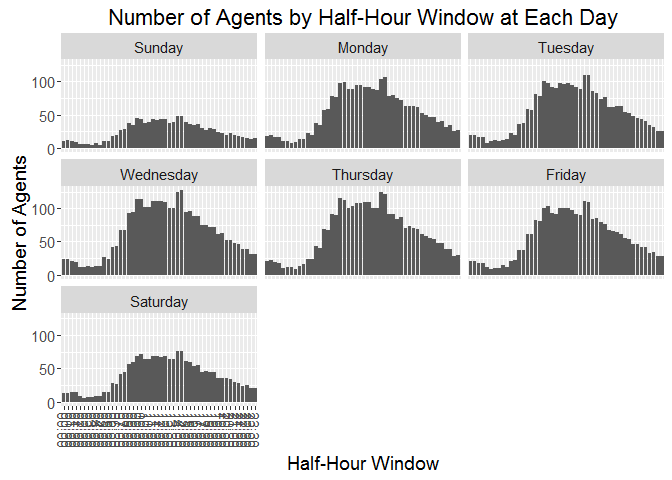
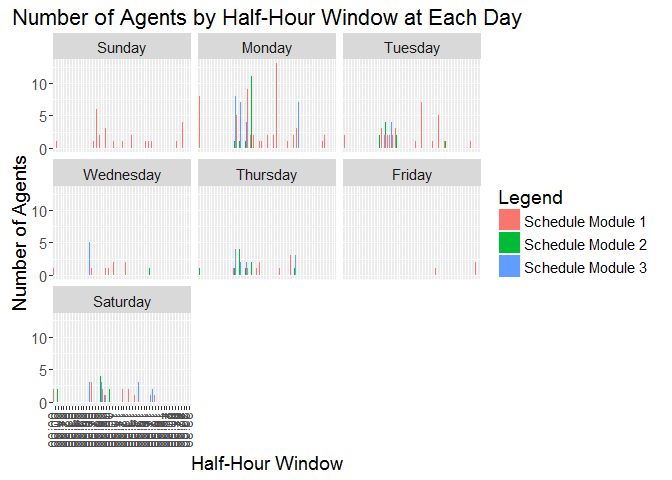

<!-- README.md is generated from README.Rmd. Please edit that file -->
scheduler
=========

`scheduler` is designed to fulfill scheduling process in operations, such as customer service center or warehouse fulfillment center, where the requirement are often the number of agents needed at each hour day, and the constraint are often the availability of each agent at each hour day.

Welcome to a [scheduler app on shinyapp.io](https://gyang.shinyapps.io/scheduler/).

An Example
----------

The package associated data `agent_requirement` demonstrates a input data format for `scheduler` - a matrix of 48 half hour window by 7 days. These are the number of agents required at each half hour window at each day.

``` r
#- load scheduler package
library(scheduler)

#- attach data in package
data("agent_requirement")

knitr::kable(agent_requirement)
```

|       |  Sunday|  Monday|  Tuesday|  Wednesday|  Thursday|  Friday|  Saturday|
|-------|-------:|-------:|--------:|----------:|---------:|-------:|---------:|
| 00:00 |      11|      18|       20|         23|        20|      21|        13|
| 00:30 |      12|      19|       20|         24|        22|      21|        13|
| 01:00 |      10|      16|       16|         20|        19|      17|        14|
| 01:30 |       9|      16|       17|         19|        17|      17|        14|
| 02:00 |       6|      10|        8|         11|        10|      11|         8|
| 02:30 |       6|      11|       10|         11|        12|       9|         5|
| 03:00 |       6|       8|       12|         13|        12|      10|         7|
| 03:30 |       4|       9|       10|         12|         9|      10|         7|
| 04:00 |       8|      13|       12|         13|        13|      14|         9|
| 04:30 |       5|      14|       14|         13|        16|      12|         9|
| 05:00 |      11|      22|       22|         27|        23|      21|        15|
| 05:30 |      11|      20|       20|         24|        23|      22|        14|
| 06:00 |      18|      37|       36|         41|        43|      37|        28|
| 06:30 |      19|      35|       38|         43|        40|      37|        27|
| 07:00 |      27|      57|       58|         67|        69|      61|        42|
| 07:30 |      29|      58|       57|         67|        68|      61|        44|
| 08:00 |      38|      78|       81|         93|        91|      83|        57|
| 08:30 |      35|      77|       78|         94|        90|      81|        60|
| 09:00 |      45|      97|      100|        114|       115|     100|        69|
| 09:30 |      43|      99|       97|        114|       112|     103|        72|
| 10:00 |      38|      89|       92|        102|       101|      93|        64|
| 10:30 |      39|      89|       90|        102|       104|      92|        64|
| 11:00 |      43|      94|       98|        111|       108|     101|        68|
| 11:30 |      42|      95|       96|        111|       108|     100|        68|
| 12:00 |      44|      92|       97|        111|       110|     101|        67|
| 12:30 |      43|      92|       94|        110|       110|      98|        69|
| 13:00 |      38|      88|       91|        101|       100|      91|        64|
| 13:30 |      39|      87|       88|        101|       100|      90|        64|
| 14:00 |      48|     104|      109|        124|       124|     111|        76|
| 14:30 |      48|     107|      109|        127|       121|     110|        76|
| 15:00 |      39|      78|       85|         95|        92|      84|        61|
| 15:30 |      36|      79|       82|         96|        92|      85|        59|
| 16:00 |      34|      75|       74|         89|        84|      79|        53|
| 16:30 |      36|      72|       77|         89|        87|      76|        55|
| 17:00 |      30|      63|       61|         75|        70|      67|        44|
| 17:30 |      27|      63|       61|         75|        73|      66|        46|
| 18:00 |      30|      63|       63|         72|        70|      64|        44|
| 18:30 |      29|      62|       63|         72|        69|      62|        44|
| 19:00 |      24|      53|       54|         61|        62|      56|        36|
| 19:30 |      22|      50|       52|         63|        59|      54|        36|
| 20:00 |      20|      46|       48|         53|        55|      46|        35|
| 20:30 |      23|      47|       45|         53|        54|      46|        34|
| 21:00 |      20|      39|       43|         47|        47|      42|        29|
| 21:30 |      18|      40|       41|         46|        47|      42|        28|
| 22:00 |      16|      32|       34|         38|        38|      33|        24|
| 22:30 |      15|      35|       32|         38|        39|      34|        25|
| 23:00 |      14|      26|       25|         31|        28|      28|        20|
| 23:30 |      15|      27|       26|         31|        30|      28|        21|

The package associated also a visualization function for viewing the requirement:

``` r
#- visualize the requirement
scheduler::schedule_viewer1(m = agent_requirement, element_text_size = 14L)
```


<p class="caption">
scheduler - visulation
</p>

The `scheduler` function takes `ar (agent_requirement)` as requirement, and makes shedules based on `sm (schedule module)` and `cr (constraints)` as constraints.

There are 3 built in `sm (schedule module)`:

-   All agents are assumed to work consecutive 5 days given a start day, e.g., when start at Thursday, agent will work on Thursday, Friday, Saturday, Sunday, Monday, and take rest on Tuesday and Wednsday.

-   In schedule module 1: agent will start an half hour window, say 08:30AM, work 3.5 hour, take 0.5 hour break, and work another 4.5 hour.

-   In schedule module 2: agent will start an half hour window, say 08:30AM, work 4.0 hour, take 0.5 hour break, and work another 4.0 hour.

-   In schedule module 3: agent will start an half hour window, say 08:30AM, work 4.5 hour, take 0.5 hour break, and work another 3.5 hour.

-   As a result, if an agent is scheduled in schedule module 1, with a start time at 08:30AM Tuesday, then he or she will work from Tuesday 08:30AM - 12:00PM, take rest 12:00PM - 12:30PM, and back to work 12:30PM - 17:00PM, and same on Wednesday, Thursday, Friday, and Saturday. He or she will take rest on Sunday, and Monday.

-   Similarly, if an agent is scheduled in schedule module 2, with a start time at 14:00PM Wednesday, then he or she will work from Wednesday 14:00PM - 18:00PM, take rest 18:00PM - 18:30PM, and back to work 18:30PM - 22:30PM, and same on Thursday, Friday, Saturday, Sunday. He or she will take rest on Monday, and Tuesday.

The argument `cr (constraints)` takes half-hour index as contraints that should remove from start time.

The half-hour index start with 1L represents 00:00AM-00:30AM half-hour window on Sunday, 2L represents 00:30AM-01:00AM half-hour window on Sunday, ..., 48L represents 23:30AM-00:00AM half-hour window on Sunday, 49L represents 00:00AM-00:30AM half-hour window on Monday, ..., and up to 336L represents 23:30AM-00:00AM half-hour window on Saturday.

By default, `cr = c(3L:12L, 51L:60L, 99L:108L, 147L:156L, 195L:204L, 243L-252L, 291L:300L)`. This implies no agent would start at 01:00AM - 05:30AM on any day.

There is another argument `allow.half.hour.start` that can be used to specify whether allowing none whole hour start time. By default, `allow.half.hour.start` is `TRUE`, so start at 7:00AM and start at 7:30AM are two schedule. If `allow.half.hour.start` is set to `FALSE`, then no agent will start at 00:30AM, 01:30AM, ..., 23:30AM on any day. This is a short cut for sepecifying all corresponding contraints with `cr`.

Suppose we want a schedule that can use all 3 schedule modules with default constraints that no one start between 01:00AM - 05:30AM on any day.

``` r
#- suppose we want a schedule with default setting
(ss_list_01 <- scheduler(
  ar = agent_requirement, sm = c(1L, 2L, 3L), timeout = 10L
))
#> $s1
#>       Sunday Monday Tuesday Wednesday Thursday Friday Saturday
#> 00:00      0      8       2         1        1      0        2
#> 00:30      1      0       0         0        0      0        0
#> 01:00      0      0       0         0        0      0        0
#> 01:30      0      0       0         0        0      0        0
#> 02:00      0      0       0         0        0      0        0
#> 02:30      0      0       0         0        0      0        0
#> 03:00      0      0       0         0        0      0        0
#> 03:30      0      0       0         0        0      0        0
#> 04:00      0      0       0         0        0      0        0
#> 04:30      0      0       0         0        0      0        0
#> 05:00      0      0       0         0        0      0        0
#> 05:30      0      0       0         0        0      0        0
#> 06:00      0      0       0         0        1      0        0
#> 06:30      0      5       3         1        0      0        3
#> 07:00      1      1       2         0        0      0        0
#> 07:30      6      0       2         0        0      0        0
#> 08:00      2      0       2         0        0      0        0
#> 08:30      0      9       2         0        1      0        2
#> 09:00      3      2       3         1        0      0        1
#> 09:30      0      2       0         1        0      0        0
#> 10:00      0      0       0         0        1      0        0
#> 10:30      1      1       0         2        2      0        0
#> 11:00      0      1       0         0        0      0        0
#> 11:30      0      0       0         0        0      0        0
#> 12:00      1      2       0         0        0      0        2
#> 12:30      0      0       1         2        0      0        0
#> 13:00      0      2       0         0        0      0        2
#> 13:30      2     13       7         0        0      0        0
#> 14:00      0      0       0         0        1      0        1
#> 14:30      0      0       0         0        0      0        0
#> 15:00      0      0       0         0        0      0        0
#> 15:30      0      1       1         0        0      0        0
#> 16:00      1      0       0         0        3      1        0
#> 16:30      1      2       5         0        0      0        0
#> 17:00      1      3       0         0        0      0        0
#> 17:30      0      0       1         0        0      0        1
#> 18:00      0      0       0         0        0      0        0
#> 18:30      0      0       0         0        0      0        0
#> 19:00      0      0       0         0        0      0        0
#> 19:30      0      0       0         0        0      0        0
#> 20:00      0      0       0         0        0      0        0
#> 20:30      0      0       0         0        0      0        0
#> 21:00      0      0       0         0        0      0        0
#> 21:30      1      1       0         0        0      0        0
#> 22:00      0      2       1         0        0      0        0
#> 22:30      4      0       0         0        0      0        0
#> 23:00      0      0       0         0        0      2        0
#> 23:30      0      0       0         0        0      0        0
#> 
#> $s2
#>       Sunday Monday Tuesday Wednesday Thursday Friday Saturday
#> 00:00      0      0       0         0        1      0        0
#> 00:30      0      0       0         0        0      0        2
#> 01:00      0      0       0         0        0      0        0
#> 01:30      0      0       0         0        0      0        0
#> 02:00      0      0       0         0        0      0        0
#> 02:30      0      0       0         0        0      0        0
#> 03:00      0      0       0         0        0      0        0
#> 03:30      0      0       0         0        0      0        0
#> 04:00      0      0       0         0        0      0        0
#> 04:30      0      0       0         0        0      0        0
#> 05:00      0      0       0         0        0      0        0
#> 05:30      0      0       0         0        0      0        0
#> 06:00      0      1       2         0        1      0        0
#> 06:30      0      0       0         0        0      0        0
#> 07:00      0      1       4         0        4      0        0
#> 07:30      0      0       0         0        0      0        0
#> 08:00      0      1       0         0        1      0        4
#> 08:30      0      0       0         0        0      0        0
#> 09:00      0     11       2         0        2      0        0
#> 09:30      0      0       0         0        0      0        2
#> 10:00      0      0       0         0        0      0        0
#> 10:30      0      0       0         0        0      0        0
#> 11:00      0      0       0         0        0      0        0
#> 11:30      0      0       0         0        0      0        0
#> 12:00      0      0       0         0        0      0        0
#> 12:30      0      0       0         0        0      0        0
#> 13:00      0      0       0         0        0      0        0
#> 13:30      0      0       0         0        0      0        0
#> 14:00      0      0       0         0        0      0        0
#> 14:30      0      0       0         0        0      0        0
#> 15:00      0      0       0         0        0      0        0
#> 15:30      0      0       0         0        0      0        0
#> 16:00      0      0       0         0        0      0        0
#> 16:30      0      0       0         1        1      0        0
#> 17:00      0      0       0         0        0      0        0
#> 17:30      0      0       1         0        0      0        0
#> 18:00      0      0       0         0        0      0        0
#> 18:30      0      0       0         0        0      0        0
#> 19:00      0      0       0         0        0      0        0
#> 19:30      0      0       0         0        0      0        0
#> 20:00      0      0       0         0        0      0        0
#> 20:30      0      0       0         0        0      0        0
#> 21:00      0      0       0         0        0      0        0
#> 21:30      0      0       0         0        0      0        0
#> 22:00      0      0       0         0        0      0        0
#> 22:30      0      0       0         0        0      0        0
#> 23:00      0      0       0         0        0      0        0
#> 23:30      0      0       0         0        0      0        0
#> 
#> $s3
#>       Sunday Monday Tuesday Wednesday Thursday Friday Saturday
#> 00:00      0      0       0         0        0      0        0
#> 00:30      0      0       0         0        0      0        0
#> 01:00      0      0       0         0        0      0        0
#> 01:30      0      0       0         0        0      0        0
#> 02:00      0      0       0         0        0      0        0
#> 02:30      0      0       0         0        0      0        0
#> 03:00      0      0       0         0        0      0        0
#> 03:30      0      0       0         0        0      0        0
#> 04:00      0      0       0         0        0      0        0
#> 04:30      0      0       0         0        0      0        0
#> 05:00      0      0       0         0        0      0        0
#> 05:30      0      0       0         0        0      0        0
#> 06:00      0      8       0         5        4      0        3
#> 06:30      0      0       0         0        0      0        0
#> 07:00      0      7       2         0        2      0        0
#> 07:30      0      0       0         0        0      0        0
#> 08:00      0      4       4         0        2      0        3
#> 08:30      0      0       0         0        0      0        1
#> 09:00      0      0       0         0        0      0        0
#> 09:30      0      0       0         0        0      0        0
#> 10:00      0      0       0         0        0      0        0
#> 10:30      0      0       0         0        0      0        0
#> 11:00      0      0       0         0        0      0        0
#> 11:30      0      0       0         0        0      0        0
#> 12:00      0      0       0         0        0      0        0
#> 12:30      0      0       0         0        0      0        0
#> 13:00      0      0       0         0        0      0        0
#> 13:30      0      0       0         0        0      0        0
#> 14:00      0      0       0         0        0      0        0
#> 14:30      0      0       0         0        0      0        3
#> 15:00      0      0       0         0        0      0        0
#> 15:30      0      0       0         0        0      0        0
#> 16:00      0      0       0         0        0      0        0
#> 16:30      0      0       0         0        3      0        1
#> 17:00      0      7       0         0        0      0        2
#> 17:30      0      0       0         0        0      0        0
#> 18:00      0      0       0         0        0      0        0
#> 18:30      0      0       0         0        0      0        0
#> 19:00      0      0       0         0        0      0        0
#> 19:30      0      0       0         0        0      0        0
#> 20:00      0      0       0         0        0      0        0
#> 20:30      0      0       0         0        0      0        0
#> 21:00      0      0       0         0        0      0        0
#> 21:30      0      0       0         0        0      0        0
#> 22:00      0      0       0         0        0      0        0
#> 22:30      0      0       0         0        0      0        0
#> 23:00      0      0       0         0        0      0        0
#> 23:30      0      0       0         0        0      0        0
#> 
#> $ss
#>       Sunday Monday Tuesday Wednesday Thursday Friday Saturday
#> 00:00     28     35      49        51       49     52       41
#> 00:30     27     33      47        52       49     48       39
#> 01:00     16     25      37        41       37     33       26
#> 01:30     13     23      24        27       23     21       14
#> 02:00     11     18      21        23       19     18       15
#> 02:30      9     20      23        25       23     22       13
#> 03:00     11     22      25        27       23     22       15
#> 03:30      7     11      13        14       11     10        9
#> 04:00      9     20      24        26       21     21       14
#> 04:30      9     20      23        25       23     22       13
#> 05:00     11     22      25        27       23     22       15
#> 05:30     11     22      25        27       23     22       15
#> 06:00     25     39      37        44       43     42       30
#> 06:30     28     47      46        53       49     48       34
#> 07:00     35     59      60        67       69     67       48
#> 07:30     39     63      66        73       77     69       48
#> 08:00     51     80      86        93       93     83       64
#> 08:30     50     81      88        94       92     82       63
#> 09:00     54     97     107       114      115    103       70
#> 09:30     56    100     111       119      117    105       72
#> 10:00     53     92      97       104      106     94       64
#> 10:30     50     89      98       103      104     92       64
#> 11:00     53     96     101       111      109    102       68
#> 11:30     59     96     101       111      111    100       72
#> 12:00     58     94     101       111      115    101       70
#> 12:30     58     97     100       111      113    102       69
#> 13:00     66    100     108       119      116    102       79
#> 13:30     69    128     144       156      155    139       89
#> 14:00     69    129     145       155      151    136       90
#> 14:30     63    117     135       142      134    118       81
#> 15:00     59    110     125       131      126    110       74
#> 15:30     49     90     104       110      101     87       59
#> 16:00     49     94     102       105       97     88       60
#> 16:30     44     81      88        94       95     87       56
#> 17:00     43     70      69        75       74     67       47
#> 17:30     37     65      71        76       73     67       46
#> 18:00     36     63      68        72       71     65       45
#> 18:30     35     62      68        72       70     64       44
#> 19:00     27     54      61        63       62     57       36
#> 19:30     25     52      63        66       59     54       36
#> 20:00     29     54      57        59       55     51       35
#> 20:30     24     47      56        57       54     51       36
#> 21:00     20     47      56        56       53     49       29
#> 21:30     22     41      47        47       49     44       30
#> 22:00     22     37      38        38       38     35       27
#> 22:30     24     39      41        41       41     34       25
#> 23:00     23     38      40        38       41     36       24
#> 23:30     23     38      40        38       41     36       24
#> 
#> $scheduleOptModel
#> Model name: 
#>   a linear program with 1008 decision variables and 546 constraints

## num of agent needed in total with this schedule
with(ss_list_01, sum(s1 + s2 + s3))
#> [1] 250
```

``` r
## a comparision on schedule and requirement side by side
scheduler::schedule_viewer2(
  m1 = agent_requirement, m2 = ss_list_01[["ss"]], 
  m1_label = "Agent Required", m2_label = "Agent Available",
  element_text_size = 14L
)
```


<p class="caption">
scheduler - visulation
</p>

``` r
## view of agent start time distribution on 3 schedule module side by side
scheduler::schedule_viewer3(
  m1 = ss_list_01[["s1"]], 
  m2 = ss_list_01[["s2"]], 
  m3 = ss_list_01[["s3"]],
  m1_label = "Schedule Module 1",
  m2_label = "Schedule Module 2",
  m3_label = "Schedule Module 3",
  element_text_size = 14L
)
```


<p class="caption">
scheduler - visulation
</p>

The output from `scheduler` is a list of 4 matrix `s1`, `s2`, `s3`, `ss` and a solved lp model `scheduleOptModel`.

The matricies `s1`, `s2` and `s3` each is a 48 x 7 matrix of number of agents required to start at each half hour window each day. The matrix `s1`, `s2`, and `s3` are a coresponding to schedule module 1, schedule module 2, and schedule module 3, respectively. For example, `s1[14, 2] = 3` implies we need 3 agents to start at 6:30AM Monday with schedule module 1. Note that even when you specify `sm = c(2L, 3L)` when calling `scheduler`, it will still return all 3 matricies `s1`, `s2`, `s3`, only that `s1` would contains all zeros.

The matrix `ss` is a 48 x 7 matrix, and is a summarize of s1, s2 and s3 to show the number of agents **available (not start)** at each half hour window. A quality solution should have `all(ss > ar)` and `ss - ar ~ 0` in all cells.

What if we want a schedule that can use schedule module 2L and 3L only, and does not all half-hour start, e.g., no agent start at 00:30AM, 01:30AM, ..., 23:30AM on any day, in addition with default constraints that no one start between 01:00AM - 05:30AM on any day.

``` r
#- suppose we want a schedule allow shedule module 2L and 3L only, 
## and disable half-hour start, more constraints - less effective.
ss_list_02 <- scheduler(
  ar = agent_requirement, sm = c(2L, 3L),
  allow.half.hour.start = FALSE,
  timeout = 10L
)

## compare the num of total agent required by solution ss_list_02
## with solution ss_list_01
with(ss_list_02, sum(s1 + s2 + s3)) - with(ss_list_01, sum(s1 + s2 + s3))
#> [1] 3
```

Intuitively, `ss_list_02` is searching the solution on a sub-space of the space where `ss_list_01` is searching the solution, so it will generally reach to a sub-optimal solution. In this case, `ss_list_02` is searching a schedule with 504 free parameters and 336 constraints, and is able to find solution with 253 agents needed in total, whereas `ss_list_01` is searching a schedule with 1008 free parameters and 336 constraints, and is able to find a relavtive better solution with 250 agents needed in total. However, it is important to note that in a problem with such many free parameters, expert knowledge is critical in formulating the problem and solution space for finding solutions that both practical and close to optimal.
